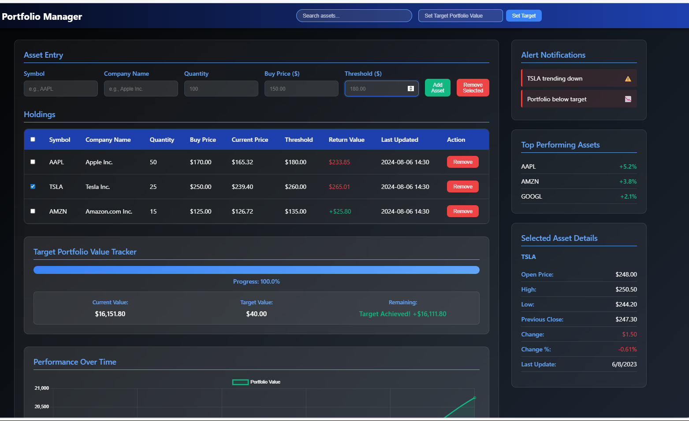

# Portfolio Manager 📈

A modern, responsive portfolio management web application built with vanilla HTML, CSS, and JavaScript. Track your investments, set target thresholds, monitor performance, and visualize your portfolio growth with interactive charts.



## ✨ Features

### 🎯 Core Functionality
- **Asset Management**: Add, edit, and remove assets with detailed information
- **Real-time Price Updates**: Simulated real-time price changes every 10 seconds
- **Threshold Monitoring**: Set target exit prices for strategic trading decisions
- **Portfolio Tracking**: Monitor total portfolio value and individual asset performance
- **Search & Filter**: Quickly find assets using the search functionality
- **Bulk Operations**: Select multiple assets for bulk removal

### 📊 Analytics & Visualization
- **Performance Charts**: Interactive line charts showing portfolio performance over time
- **Progress Tracker**: Visual progress bar for target portfolio value achievement
- **Return Calculations**: Real-time profit/loss calculations with color-coded indicators
- **Asset Details Panel**: Comprehensive asset information including OHLC data

### 🎨 User Experience
- **Modern Dark Theme**: Sleek gradient design with glassmorphism effects
- **Responsive Design**: Fully responsive layout that works on all devices
- **Interactive Animations**: Smooth hover effects and transitions
- **Real-time Updates**: Live data simulation for realistic trading experience

### 📤 Data Management
- **CSV Export**: Export your portfolio data for external analysis
- **Persistent State**: Maintain data integrity during the session
- **Multiple Asset Support**: Handle unlimited number of assets

## 🚀 Quick Start

### Prerequisites
- A modern web browser (Chrome, Firefox, Safari, Edge)
- No additional software installation required

### Installation

1. **Clone the repository**
   ```bash
   git clone https://github.com/yourusername/portfolio-manager.git
   cd portfolio-manager
   ```

2. **Open the application**
   ```bash
   # Simply open index.html in your browser
   open index.html  # macOS
   start index.html # Windows
   xdg-open index.html # Linux
   ```

   Or use a local server:
   ```bash
   # Python 3
   python -m http.server 8000
   
   # Node.js (if you have http-server installed)
   npx http-server
   ```

3. **Access the application**
   Open your browser and navigate to `http://localhost:8000` (if using a local server) or directly open the `index.html` file.

## 📁 Project Structure

```
portfolio-manager/
│
├── index.html          # Main HTML structure
├── css/
│   └── styles.css      # Styling and responsive design
├── js/
│   └── script.js       # Core functionality and logic
└── README.md           # Project documentation
```

## 🛠️ Usage Guide

### Adding Assets
1. Fill in the **Asset Entry** form with:
   - **Symbol**: Stock ticker (e.g., AAPL, TSLA)
   - **Company Name**: Full company name
   - **Quantity**: Number of shares
   - **Buy Price**: Purchase price per share
   - **Threshold**: Target exit price for the asset
2. Click **"Add Asset"** to add to your portfolio

### Managing Holdings
- **View Holdings**: All assets are displayed in the holdings table
- **Select Assets**: Use checkboxes to select individual assets
- **Remove Assets**: Use "Remove" button for individual assets or "Remove Selected" for bulk removal
- **Search Assets**: Use the search bar to filter assets by symbol or company name

### Setting Portfolio Targets
1. Enter your target portfolio value in the navigation bar
2. Click **"Set Target"** to activate progress tracking
3. Monitor your progress with the visual progress bar

### Monitoring Performance
- **Real-time Updates**: Prices update automatically every 10 seconds
- **Performance Charts**: View historical performance in the interactive chart
- **Asset Details**: Select assets to view detailed information in the sidebar
- **Alerts**: Monitor important notifications in the alerts panel

### Exporting Data
1. Click **"Export as CSV"** in the footer
2. Your portfolio data will be downloaded as a CSV file
3. Open in Excel, Google Sheets, or any spreadsheet application

## 🎨 Customization

### Styling
The application uses CSS custom properties for easy theming:

```css
:root {
  --primary-blue: #1e40af;
  --dark-blue: #1e3a8a;
  --light-blue: #3b82f6;
  --accent-blue: #60a5fa;
  --success: #10b981;
  --danger: #ef4444;
  --warning: #f59e0b;
}
```

### Adding New Features
The modular JavaScript structure makes it easy to extend:

```javascript
// Add new functionality to the portfolioData array
function customFeature() {
  // Your custom logic here
  updateProgressTracker();
}
```

## 📱 Browser Compatibility

| Browser | Supported Versions |
|---------|-------------------|
| Chrome  | 60+ |
| Firefox | 55+ |
| Safari  | 12+ |
| Edge    | 79+ |

## 🔧 Technical Details

### Dependencies
- **Chart.js**: For interactive charts and data visualization
- **Vanilla JavaScript**: No framework dependencies
- **CSS Grid & Flexbox**: For responsive layouts
- **CSS Custom Properties**: For consistent theming

### Performance Features
- **Efficient DOM Updates**: Minimal DOM manipulation for smooth performance
- **Debounced Search**: Optimized search functionality
- **Lazy Loading**: Charts initialize only when needed
- **Memory Management**: Proper cleanup of intervals and event listeners

## 🤝 Contributing

We welcome contributions! Here's how you can help:

1. **Fork the repository**
2. **Create a feature branch**
   ```bash
   git checkout -b feature/amazing-feature
   ```
3. **Commit your changes**
   ```bash
   git commit -m 'Add some amazing feature'
   ```
4. **Push to the branch**
   ```bash
   git push origin feature/amazing-feature
   ```
5. **Open a Pull Request**

### Development Guidelines
- Follow existing code style and conventions
- Add comments for complex functionality
- Test across multiple browsers
- Update documentation for new features

## 🐛 Known Issues

- Real-time data is simulated for demonstration purposes
- Browser storage is not implemented (data persists only during session)
- Mobile optimization could be enhanced for smaller screens

## 📋 Roadmap

- [ ] **Real API Integration**: Connect to actual stock market APIs
- [ ] **User Authentication**: Add user accounts and data persistence
- [ ] **Advanced Charts**: More chart types and technical indicators
- [ ] **Mobile App**: React Native or PWA version
- [ ] **Portfolio Analysis**: Advanced analytics and insights
- [ ] **Alert System**: Email/SMS notifications for threshold breaches
- [ ] **Multiple Portfolios**: Support for multiple portfolio management

## 📄 License

This project is licensed under the MIT License - see the [LICENSE](LICENSE) file for details.

## 🙏 Acknowledgments

- **Chart.js** team for the excellent charting library
- **Design inspiration** from modern fintech applications
- **Community feedback** for feature suggestions and improvements


## 🌟 Show Your Support

Give a ⭐️ if this project helped you manage your portfolio better!

---

**Made with ❤️ by [Dnyaneshwwari Garule]**

*Happy Trading! 📈*
